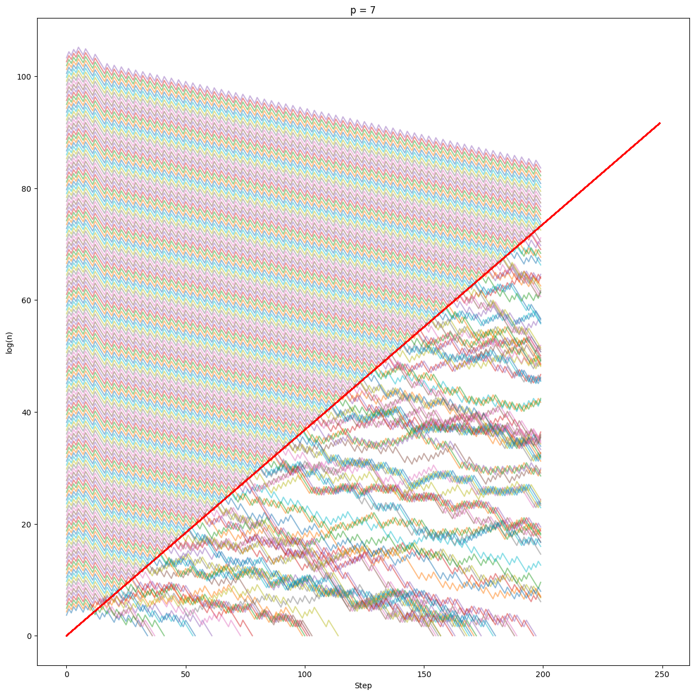
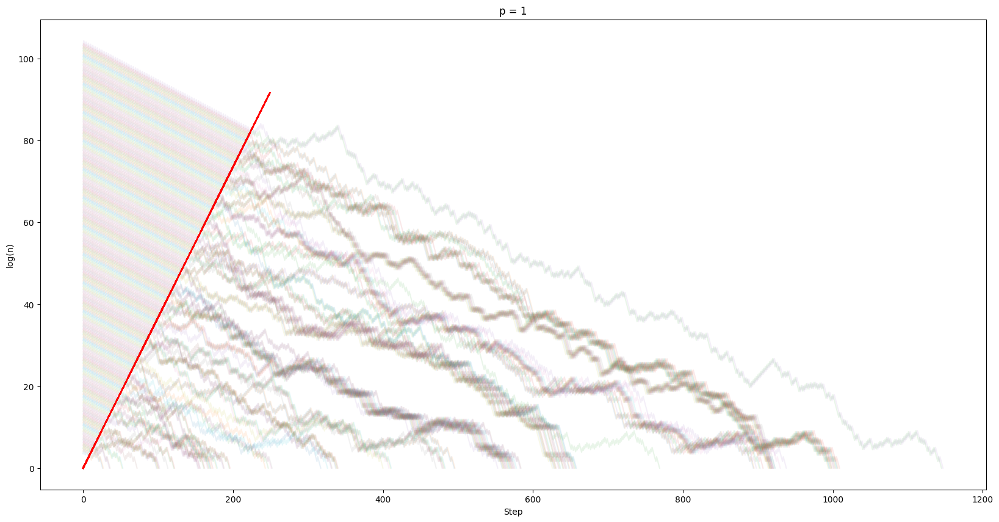

During my exploration of the Collatz conjecture as a personal endeavor, I have made intriguing observations that I believe warrant further examination. I am seeking expert opinions to assess the significance of my findings, identify any potential oversights or flaws in my observations. To the best of my knowledge, I have not encountered any existing literature that explores the relationship between the Collatz conjecture and the $$y=e^{x/e}$$ function, or investigates periodicity on a logarithmic scale. Therefore, I would like to share the following observations for consideration:

- **I found interesting patterns for n's that are of the form $$n=2^m+p$$.** In the case of a positive p, a periodic decreasing pattern can be observed, where the periodicity can be observed up to the value of $$e ^ (i/e)$$, where $i$ is the number of steps.
.png)
- In the case of positive $p$, the start of the periodicity depends on $p$ but is independent of $m$, starting from a certain step number $k$. For a given $p$, **the sequence for every n=2^m+p is similar**, being vertically shifted on the log scale. I haven't yet figured out how $k$ could be determined.

- In the case of negative $p$, the periodic motion first increases the value and then decreases randomly.
- In the case of negative $p$, many values start to decrease after $$e^{(i/(e-0.5))}$$, where $i$ is the step number.
- These cases are for $p=: -5, -7, -9, -10, -13, -14, -17, -18, -19, -20, -21, -23, -25, -26, -27, -28, …$
- In other cases, the periodicity can probably be bounded by a slightly steeper exponential function, but I haven't been able to hit on that yet.
- In the case of $$n=6^m+p$$, for both negative and positive p, it's periodic up to $$e^{(3*i/e)}$$.
- The randomly decreasing paths on the log scale seem to converge towards the number of steps needed to reach 1, like streams.

